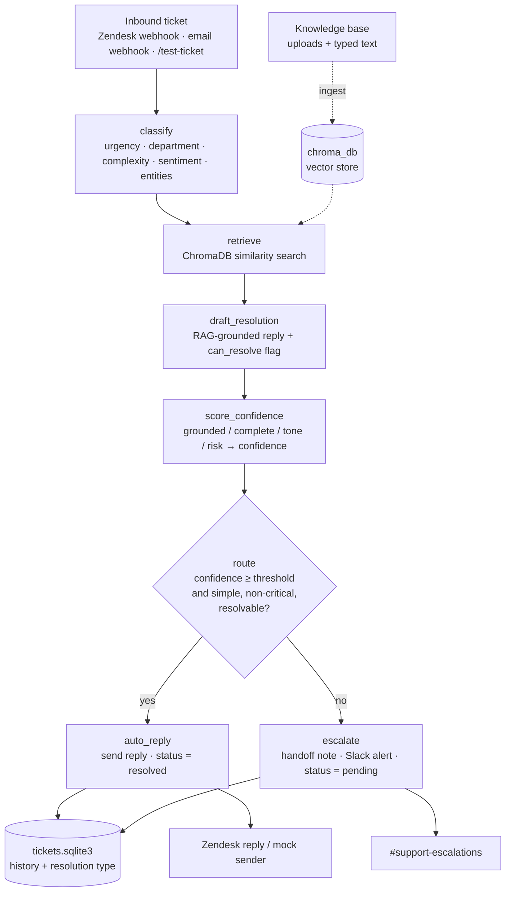

## Architecture

```mermaid
flowchart TD
    T["Inbound ticket<br/>Zendesk webhook · email webhook · /test-ticket"]
    C["classify<br/>urgency · department · complexity · sentiment · entities"]
    R["retrieve<br/>ChromaDB similarity search"]
    D["draft_resolution<br/>RAG-grounded reply + can_resolve flag"]
    S["score_confidence<br/>grounded / complete / tone / risk → confidence"]
    RT{"route<br/>confidence ≥ threshold<br/>and simple, non-critical,<br/>resolvable?"}
    A["auto_reply<br/>send reply · status = resolved"]
    E["escalate<br/>handoff note · Slack alert · status = pending"]
    TS[("tickets.sqlite3<br/>history + resolution type")]
    CH[("chroma_db<br/>vector store")]
    KB["Knowledge base<br/>uploads + typed text"]

    T --> C --> R --> D --> S --> RT
    RT -->|yes| A
    RT -->|no| E
    A --> TS
    E --> TS
    A --> OUT["Zendesk reply / mock sender"]
    E --> SL["#support-escalations"]
    CH -.-> R
    KB -. ingest .-> CH
```
